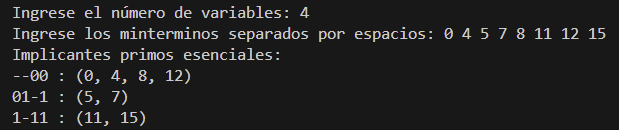

# QuineMcCluskey

# QuineMcCluskey

## Descripción

Este proyecto es una implementación del algoritmo de Quine-McCluskey, diseñado para simplificar expresiones lógicas minimizando la cantidad de términos y variables utilizadas, sin cambiar el resultado final de la expresión.

## Uso

Para utilizar este programa, sigue los pasos a continuación:

1. Ejecuta el archivo `quine_mccluskey.py`.
2. Cuando se te solicite `Ingrese el número de variables:`, introduce el número de variables diferentes que tiene tu expresión lógica.
3. A continuación, se te pedirá `Ingrese los minterminos separados por espacios:`. Debes introducir los minterminos que deseas simplificar, separados por espacios.
4. El programa procesará la información y retornará los `Implicantes primos esenciales:` que representan la forma simplificada de tu expresión lógica.

### Ejemplo de Uso:

```bash
Ingrese el número de variables: 4   
Ingrese los minterminos separados por espacios: 0 4 5 7 8 11 12 15
Implicantes primos esenciales:
--00 : (0, 4, 8, 12)
01-1 : (5, 7)
1-11 : (11, 15)
```

O en imagen: 



## Cómo Funciona

El proceso general del algoritmo es el siguiente:

1. **Inicialización:** Se recibe el número de variables y los minterminos de la expresión lógica.
2. **Creación de Implicantes Primos:** Se crea un conjunto único de implicantes primos, representando cada uno por su forma binaria y los minterminos que cubre.
3. **Fusión de Implicantes:** Se intenta combinar implicantes basándose en la cantidad de unos que contienen, considerando solo aquellos que difieren en un bit. Durante este proceso, se ajusta la lista de minterminos correspondientes.
4. **Identificación de Implicantes Primos Esenciales:** Se utilizan estructuras como diccionarios para identificar qué minterminos están cubiertos por cada implicante primo, permitiendo así encontrar los implicantes primos esenciales.
5. **Ajuste Final:** En caso de que algunos implicantes hayan sido eliminados erróneamente, se reintegran para asegurar la cobertura completa de la expresión original.

Este enfoque garantiza una simplificación efectiva de expresiones lógicas, optimizando su complejidad y facilitando su interpretación y aplicación práctica.


